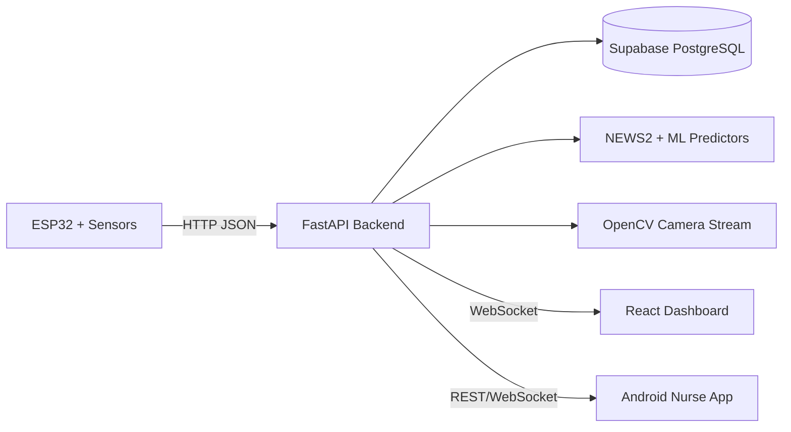

# Patient Monitoring System Using AI

An embedded-first patient monitoring platform built as a final-year ECE project. It centers on real sensor acquisition, ESP32-based data transmission, and hardware-software integration, with software layers supporting visualization, alerting, and patient tracking.

## At a Glance

- Hardware mode: ESP32 streams live readings from MAX30102 and DS18B20 devices.
- Signal flow: sensor data is captured, transmitted, normalized, and routed into the monitoring pipeline in real time.
- Simulation mode: the backend generates synthetic vitals and alarm states for demos and development.
- Integration: hardware, backend, web dashboard, and mobile app work together as one monitoring system.
- Presentation: the root stays focused on code, docs, and assets so the repository reads cleanly on GitHub.

## Why This Project Matters

This system is designed to show more than raw monitoring. It combines physiological readings with patient context, ward type, and medication-aware alarm logic so alerts are more meaningful and less noisy. That makes it a strong portfolio project because it demonstrates embedded sensing, device communication, backend design, mobile support, ML workflow, and hardware-software integration in one place.

## Start Here

If you are a recruiter, reviewer, or first-time visitor, the fastest path is:

1. Read this README for the big picture.
2. Open [docs/PROJECT_CLEANUP_PLAN.md](docs/PROJECT_CLEANUP_PLAN.md) to see what is canonical and what is archived.
3. Skim [docs/reference/PROJECT_OVERVIEW.md](docs/reference/PROJECT_OVERVIEW.md) for the deeper technical story.
4. Look at [assets/figures](assets/figures) and [assets/flowcharts](assets/flowcharts) for the visual summary.

## System Architecture



## Hardware Components

| Component | Role | Interface |
|---|---|---|
| ESP32 | Sends sensor readings over WiFi | HTTP POST JSON |
| MAX30102 | Heart rate and SpO2 sensing | I2C |
| DS18B20 | Body temperature sensing | OneWire |

When hardware mode is enabled, only HR, SpO2, and temperature are measured directly. The backend estimates the remaining vitals when needed, which keeps the embedded side lightweight while still supporting a complete monitoring workflow.

## Platform Stack

- Embedded layer: ESP32, MAX30102, DS18B20, HTTP sensor streaming
- Backend layer: Python, FastAPI, asyncpg, Pydantic, OpenCV
- Web layer: React, Vite, JavaScript
- Mobile layer: Android Kotlin
- Data layer: Supabase PostgreSQL
- ML layer: scikit-learn, pandas, NumPy, joblib

## Key Features

### Embedded and Hardware

- ESP32-based live sensor acquisition from MAX30102 and DS18B20
- Real-time transmission of sensor data into the monitoring pipeline
- Hardware mode designed to keep the embedded device focused on capture and communication
- Clear separation between measured vitals and backend-estimated vitals

### System and Software Integration

- Real-time patient admission and monitoring
- NEWS2-based scoring with disease-aware escalation
- General and critical ward alarm logic
- WebSocket updates for dashboard and nurse app
- Camera snapshot and MJPEG streaming support

### Web and Mobile

- React dashboard for admissions, vitals, and patient tracking
- Android nurse app for live alerts and follow-up
- Support for both general and critical ward workflows

### Project Artifacts

- Patent-oriented reporting and flowchart generation assets
- Clean documentation split into `docs/`
- Archived drafts kept out of the main code flow

## Setup Instructions

### Backend

```powershell
cd backend
pip install -r requirements.txt
copy .env.example .env
python -m uvicorn main:app --host 0.0.0.0 --port 8000 --reload
```

API docs: http://localhost:8000/docs

### Web Frontend

```powershell
cd frontend_new
npm install
npm run dev -- --host 0.0.0.0 --port 3000
```

### Android App

```powershell
cd mobile_app/NurseAlarmApp
.\gradlew installDebug
```

### ML Artifacts

Model-training scripts live in `ML/`. Generated model binaries are treated as build artifacts and should only be committed if they are intentionally versioned.

## Patent Information

- Indian Patent Application No: IN202641077415
- Status: Published, Pending Examination

## Images and Flowcharts

Current visual assets are kept separate from code:

- [FIG1_Patient_Admission_Data_Acquisition.png](assets/figures/FIG1_Patient_Admission_Data_Acquisition.png)
- [FIG2_ML_Feature_Engineering_Prediction.png](assets/figures/FIG2_ML_Feature_Engineering_Prediction.png)
- [FIG3_Alarm_Policy_Engine.png](assets/figures/FIG3_Alarm_Policy_Engine.png)
- [FIG4_Logging_Broadcast_Discharge.png](assets/figures/FIG4_Logging_Broadcast_Discharge.png)
- [PATENT_FLOWCHART.png](assets/flowcharts/PATENT_FLOWCHART.png)

## Future Work

- Keep moving archived notes into `docs/` so the root stays readable.
- Continue consolidating the frontend into a single canonical web app tree.
- Replace demo-oriented artifacts with a release packaging workflow.
- Add automated backend tests and Android instrumentation coverage.
- Separate generated ML artifacts from source-controlled code.

## ECE Angle

If you want to describe this project in one sentence for an ECE audience, use this:

> An ESP32-based patient monitoring system that acquires sensor data, transmits it reliably to a backend, and integrates embedded hardware with software layers for real-time clinical monitoring.

## Recommended Branches

For future work, these branches make the repo easier to manage:

- `main` for stable releases
- `feature/ml-improvements` for model and scoring updates
- `feature/mobile-app` for Android changes
- `feature/hardware-v2` for sensor and firmware work
- `experimental` for risky prototypes

## Repository Layout

```text
Project/
├── README.md
├── LICENSE
├── .gitignore
├── backend/
├── frontend_new/
├── mobile_app/
├── ML/
├── docs/
├── assets/
└── requirements.txt
```

## Documentation

The cleanup and archive plan is recorded in [docs/PROJECT_CLEANUP_PLAN.md](docs/PROJECT_CLEANUP_PLAN.md).

## License

This project is licensed under the MIT License. See [LICENSE](LICENSE).
